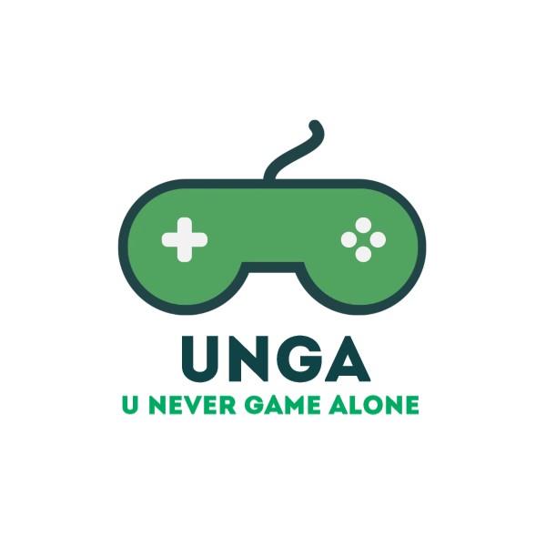

<p align="center">
  
</p>

# UNGA - U Never Game Alone 
[ ](https://unevergamealone.ddnss.de) [](https://dhbw-fn-tit20.github.io/unevergamealone/)

This is a student project of the DHBW RV Campus FN. The purpose of this webapp is that gamers can find other gamers playing the same game. Gamers have to register and afterwards they can add existing games to their profille or create new games.

# Getting started
- [UNGA - U Never Game Alone](#unga---u-never-game-alone)
- [Getting started](#getting-started)
- [Manually](#manually)
  - [Clone the repo:](#clone-the-repo)
  - [Dependencies:](#dependencies)
  - [Configuration](#configuration)
  - [Start UNGA](#start-unga)
- [Docker](#docker)
  - [Build the Container](#build-the-container)
  - [Run the Container](#run-the-container)
# Manually
Here you can see how to run the application manually.<br />
Be sure you have **Node.js v16.x:** and **npm** installed! See [README.md](https://github.com/nodesource/distributions/blob/master/README.md)

## Clone the repo:
Run:
```bash
# Clone the Repo
git clone https://github.com/DHBW-FN-TIT20/unevergamealone.git
cd unevergamealone
```
## Dependencies:
Install the dependencies with npm:
```bash
# Update npm
npm install -g npm@latest

# Install only production dependencies
npm install --production

# Install also developer dependencies
npm install --include=dev
```

If you get an error from `node-gyp` be sure to have installed a compatible version of Python, one of: v3.7, v3.8, v3.9, or v3.10. See more at [node-gyp](https://github.com/nodejs/node-gyp#configuring-python-dependency)<br/> To set the python path do:
```bash
npm config set python /usr/bin/python3
```

## Configuration
**Port**: <br/>
Default Port is set to 3000. If you want to change it you habe to set the ENV `PORT`:
```bash
# Set it in the bash
export PORT=80

# Set it in the .env
nano .env
```

**In Production**: <br/>
If the ENV "`NODE_ENV`" is set to `production` the `.env`-File will be ignored!<br />
Set the ENV:
```bash
export JWT_TOKEN=MY_SECRETKEY!
```

**Not in Production**: <br/>
You can set the `JWT_TOKEN` in the bash or on the `.env`-File
```bash
# Set it in the bash
export JWT_TOKEN=MY_SECRETKEY!

# Set it in the .env
nano .env
```

## Start UNGA
Run:
```bash
# Start it with npm
npm start

# OR

# Start it with node
node ./bin/www
```

# Docker
You can run the application also in a Docker-Container

## Build the Container
If you do not want to use buildkit remove `DOCKER_BUILDKIT=1` from the command. The contaienr will get the name "unevergamealone"
```shell
# Direct from the Repo
DOCKER_BUILDKIT=1 docker build -t unevergamealone https://github.com/DHBW-FN-TIT20/unevergamealone.git#main

# Local
git clone https://github.com/DHBW-FN-TIT20/unevergamealone
cd unevergamealone
DOCKER_BUILDKIT=1 docker build -t unevergamealone .

# You also can use the Makefile
git clone https://github.com/DHBW-FN-TIT20/unevergamealone
cd unevergamealone
make build
```

## Run the Container
```bash
docker run \
    --rm \
    -d \
    -e JWT_TOKEN=SECRET_KEY \
    -v database:/app/database \
    -v uploads:/app/public/images/upload \
    -p 80:3000 \
    --name my-container-name \
    unevergamealone
```

